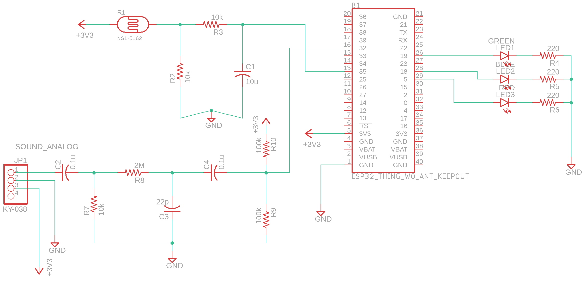
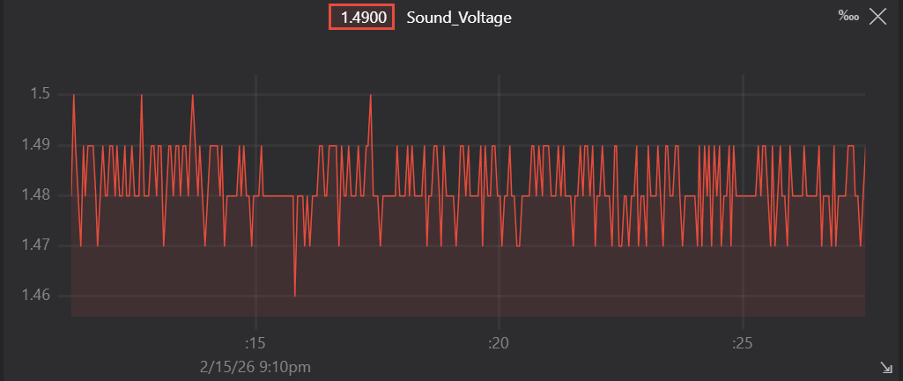
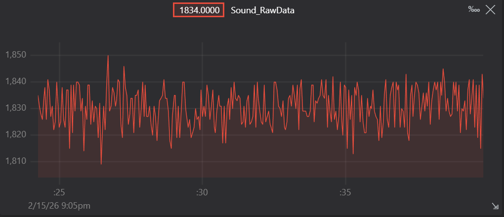
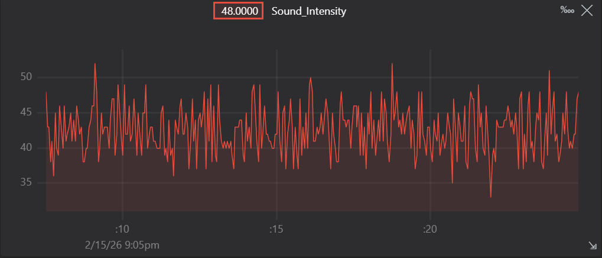
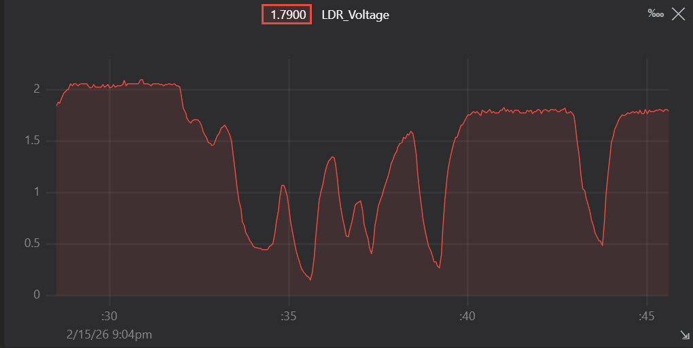

# Analog Signal Processing & Real-Time Acquisition

  

## 📖 Overview
This project demonstrates the design and implementation of a mixed-signal environmental monitoring system using an **ESP32**. The system captures and processes two distinct types of physical signals:

1.  **Dynamic AC Signals (Audio):** High-frequency sound intensity using a custom hardware band-pass filter and burst sampling.
2.  **Static DC Signals (Light):** Low-frequency ambient light levels using an LDR with hardware smoothing and hysteresis-based control.

The goal was to move beyond basic "digital read" logic and implement **Analog Signal Conditioning** to improve Signal-to-Noise Ratio (SNR) and system stability before data reaches the microcontroller.

---

## 🔧 Hardware Architecture: Signal Conditioning

### 1. The Audio Path (AC Signal Processing)
**Sensor:** KY-038 Microphone Module (Analog Mode)
* **Challenge:** The raw output contained significant DC offset and high-frequency electronic noise, making "quiet" vs "loud" distinction unreliable.
* **Solution: Passive RC Band-Pass Filter & DC Bias**
    * **High-Pass Stage:** Removes the sensor's DC offset, isolating the pure AC sound wave.
    * **Low-Pass Stage:** Filters out high-frequency noise and prevents aliasing during ADC sampling.
    * **DC Bias Network:** A voltage divider ($2 \times 100k\Omega$) re-centers the clean AC signal to **1.65V** (midpoint of the ESP32's 3.3V ADC), ensuring the full negative half of the sound wave is readable without clipping.

### 2. The Light Path (DC Signal Processing)
**Sensor:** Light Dependent Resistor (LDR)
* **Challenge:** LDRs in indoor environments are prone to "micro-jitter" caused by the 50Hz/60Hz flicker of artificial lighting (mains hum) and transient shadows. Reading this directly results in a noisy signal that causes actuator flickering.
* **Solution: Hardware Passive Low-Pass Filter (Integrator)**
    * **Architecture:** An RC circuit placed between the LDR voltage divider and the ESP32 ADC pin.
    * **Physics:** The capacitor charges and discharges slowly, effectively "integrating" the incoming voltage.
    * **Time Constant ($\tau$):** Designed with $\tau \approx 0.1s$. This creates a cutoff frequency that heavily attenuates any signal changing faster than 10Hz (including the 50Hz mains hum).
    * **Result:** The ESP32 receives a **clean, smooth DC voltage** that represents the true *average* light intensity, eliminating the need for heavy software filtering and saving CPU cycles.


*Figure 1: Complete System Schematic designed in EAGLE, showing the Signal Conditioning stages.*

---

## 💻 Firmware Architecture: Windowed Burst Sampling

To manage the conflicting timing requirements of high-speed audio and slow-speed light monitoring, the firmware utilizes a **Time-Division Multiplexing** strategy.

### 1. Audio "Burst" Integration Window
* **Logic:** The CPU enters a dedicated **50ms Integration Window** (blocking loop).
* **Sampling Rate:** Inside this window, the ADC oversamples the microphone at approximately **10kHz**.
* **Purpose:** This high-speed burst captures the transient peaks and valleys of the AC waveform to calculate the **Peak-to-Peak Amplitude** (Loudness), which would be missed by standard slow sampling.

### 2. Telemetry & Control Cycle
* **Logic:** Immediately following the 50ms audio burst, the system performs a single "housekeeping" cycle.
* **Update Rate:** This results in an effective **20Hz refresh rate** for the LDR.
* **Benefit:** Because the **Hardware Low-Pass Filter** has already cleaned the LDR signal, the software does not need to oversample or average the light data. A single read is sufficient and accurate, keeping the loop efficient.

---

## 🚀 Key Technical Highlights

### 🛡️ Noise Immunity & Hysteresis
* **Hardware:** Integrated filters on both inputs (Band-Pass for Audio, Low-Pass for Light) ensure signal integrity at the source.
* **Software:** Implemented **Software Hysteresis (Schmitt Trigger logic)** for the LED indicators.
    * **Margin:** $\pm 0.05V$.
    * **Effect:** Prevents actuator "chattering" (rapid on/off flickering) when the LDR voltage hovers near the critical thresholds (1.1V and 2.2V).

### 📊 Data Validation
* **Verification:** Signal integrity was verified visually using **Teleplot**.
    * Confirmed the centering of the Audio AC wave at around 1.65V (DC Bias check).
    * Verified the "Peak-to-Peak" algorithm correctly identified loudness spikes vs. background noise.
    * **LDR Analysis:** Confirmed the LDR voltage curve (Figure 5) is smooth and devoid of 50Hz ripple, proving the effectiveness of the RC Low-Pass filter.


*Figure 2: Real-time waveform analysis showing sound voltage against time*


*Figure 3: Real-time waveform analysis showing raw sound data against time*


*Figure 4: Real-time waveform analysis showing sound Intensity against time*


*Figure 5: Real-time waveform analysis showing smoothed LDR voltage against time. Note the absence of high-frequency noise.*

---

## ⚖️ Design Trade-offs
* **Passive vs. Active Filtering:** I chose **Passive RC Filters** over Active Op-Amp filters to reduce component count and power consumption. While this results in slight signal attenuation (Gain < 1), it is acceptable for relative loudness detection and simplifies the circuit complexity.
* **Blocking vs. Non-Blocking:** A **Windowed Burst** approach (blocking for 50ms) was chosen over a purely interrupt-driven approach. This simplifies the DSP math for peak-detection while still maintaining a refresh rate (20Hz) that is faster than human perception for the LED indicators.

---

## 🔌 Pinout & Wiring (Sensor Interface)

| Component | ESP32 Pin | Function |
| :--- | :--- | :--- |
| **Sound Input** | GPIO 32 (ADC) | **AC Coupled:** Filtered & Biased Audio Signal (Centered @ 1.65V) |
| **LDR Input** | GPIO 35 (ADC) | **DC Coupled:** Low-Pass Filtered Light Level Voltage |

---

## 🛠️ Getting Started

### Prerequisites
* ESP32 Development Board
* PlatformIO (VS Code Extension) OR Arduino IDE

### Installation
1.  **Clone the Repo:**
    ```bash
    git clone [https://github.com/yourusername/ESP32-Analog-Signal-Processing.git](https://github.com/yourusername/ESP32-Analog-Signal-Processing.git)
    ```
2.  **Hardware Setup:** * Wire the filters according to `docs/schematic_diagram.png`.

3.  **Flash Firmware:** * Open `src/main.cpp` in your IDE.
    * Build and Upload to the ESP32.
4.  **Visualize:** * Open **Teleplot** (VS Code Extension) or Serial Plotter.
    * Set Baud Rate to `115200`.

---

## 🔮 Future Improvements
* **FFT Frequency Analysis:** Move from simple "Peak-to-Peak" amplitude detection to **Fast Fourier Transform (FFT)**. This would allow the system to distinguish between different *types* of noise (e.g., distinguishing a low-frequency door slam from high-frequency glass breaking).
* **Adaptive Software Thresholding:** Implement a moving average algorithm in software to automatically calibrate the "Day/Night" thresholds based on the ambient light history of the last hour, rather than using hard-coded values (1.1V / 2.2V).
* **Remote IoT Logging (MQTT):** Integrate an MQTT client to transmit the conditioned data to a cloud dashboard (e.g., AWS IoT Core or ThingsBoard) for long-term environmental analysis and noise pollution heat-mapping.
* **PCB & SMD Transition:** Convert the breadboard prototype into a custom PCB shield using Surface Mount Devices (SMD) to reduce parasitic capacitance and improve the filter characteristics even further.
* **Low Power Optimization:** Utilize the ESP32's ULP (Ultra Low Power) coprocessor to monitor the LDR while the main CPU sleeps, waking only when a significant light change occurs.

---

## 📄 License
This project is licensed under the MIT License - see the [LICENSE](LICENSE) file for details.
